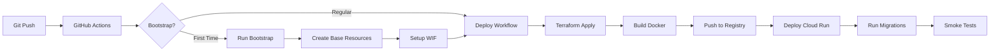

# Infrastructure Overview

This document provides an overview of the infrastructure setup and deployment architecture for the Portfolio Django application on Google Cloud Platform.

## Directory Structure

```
.
├── .github/
│   └── workflows/
│       ├── bootstrap.yaml         # One-time setup workflow
│       └── deploy.yaml            # Main deployment workflow
├── docker/
│   ├── Dockerfile                 # Multi-stage Docker build
│   └── .dockerignore             # Docker build exclusions
├── terraform/
│   ├── bootstrap/                # Initial GCP setup
│   │   ├── main.tf              # WIF, Artifact Registry, State bucket
│   │   ├── variables.tf         # Bootstrap variables
│   │   └── outputs.tf           # Bootstrap outputs
│   └── infrastructure/          # Application infrastructure
│       ├── main.tf              # Cloud Run, Cloud SQL, Storage
│       ├── variables.tf         # Infrastructure variables
│       ├── outputs.tf           # Infrastructure outputs
│       └── backend.tf           # Terraform state configuration
├── portfolio/
│   ├── settings_production.py   # Production Django settings
│   └── storage_backends.py      # GCS storage configuration
└── apps/                        # Django applications

```

## Technology Stack

### Infrastructure as Code
- **Terraform**: Manages all GCP resources
- **GitHub Actions**: CI/CD pipeline orchestration

### Google Cloud Services
- **Cloud Run**: Serverless container hosting
- **Cloud SQL**: Managed PostgreSQL database
- **Cloud Storage**: Static and media file storage
- **Artifact Registry**: Docker container registry
- **Secret Manager**: Secure secrets storage
- **VPC**: Network isolation for Cloud SQL

### Security
- **Workload Identity Federation**: Keyless authentication
- **Service Accounts**: Least-privilege access
- **Private VPC**: Database network isolation

## Deployment Flow



## Key Components

### 1. Bootstrap Phase (One-time)
Creates foundational resources:
- Terraform state bucket
- Workload Identity Federation setup
- Artifact Registry
- Service Accounts
- Initial secrets

### 2. Infrastructure Deployment
Manages application infrastructure:
- Cloud SQL instance with private IP
- VPC and connector for Cloud Run
- Cloud Storage buckets
- Cloud Run service configuration

### 3. Application Deployment
Handles application lifecycle:
- Docker image build (multi-stage)
- Container registry push
- Cloud Run deployment
- Database migrations
- Health checks

## Environment Configuration

### Production Settings
The `portfolio/settings_production.py` file:
- Integrates with Google Secret Manager
- Configures Cloud Storage for static/media
- Sets up Cloud SQL connection
- Implements security best practices

### Docker Configuration
The `docker/Dockerfile`:
- Uses multi-stage build for size optimization
- Includes all production dependencies
- Runs as non-root user
- Configures for Cloud Run environment

## Workflow Files

### bootstrap.yaml
- **Trigger**: Manual (workflow_dispatch)
- **Purpose**: Initial GCP setup
- **Inputs**: Project ID, Region, GitHub info
- **Creates**: All foundational resources

### deploy.yaml
- **Trigger**: Push to main/production or manual
- **Purpose**: Deploy application updates
- **Steps**: Infrastructure → Build → Deploy → Test
- **Features**: Rollback capability, smoke tests

## Security Considerations

1. **No Service Account Keys**: Uses Workload Identity Federation
2. **Secrets in Secret Manager**: Never in code or environment
3. **Private Database**: Cloud SQL only accessible via VPC
4. **HTTPS Only**: Enforced by Cloud Run
5. **Non-root Container**: Security best practice

## Cost Optimization

- **Cloud Run**: Scales to zero when idle
- **Cloud SQL**: Can use smaller instances for dev/staging
- **Storage Lifecycle**: Auto-delete old files
- **Artifact Registry**: Clean up old images

## Quick Commands

```bash
# View current deployment
gcloud run services describe portfolio-production --region=us-central1

# Check logs
gcloud run services logs read portfolio-production --region=us-central1

# Manual migration
gcloud run jobs execute migrate-manual --region=us-central1

# List Docker images
gcloud artifacts docker images list --repository=portfolio-images --location=us-central1
```

## Monitoring

- **Cloud Run Metrics**: CPU, memory, requests
- **Cloud SQL Insights**: Query performance, connections
- **Error Reporting**: Automatic error tracking
- **Logging**: Structured logs to Cloud Logging

## Disaster Recovery

1. **Database Backups**: Daily automated backups
2. **Terraform State**: Versioned in GCS
3. **Container Images**: Tagged with commit SHA
4. **Rollback**: One-command revision switch

## Next Steps

1. Review `DEPLOYMENT_GUIDE.md` for detailed setup instructions
2. Run bootstrap workflow to initialize infrastructure
3. Configure repository secrets
4. Deploy application via push to main branch

## Support Files

- `DEPLOYMENT_GUIDE.md`: Step-by-step deployment instructions
- `CLAUDE.md`: Development environment documentation
- `PROJECT_README.md`: Original project documentation

## Important Notes

- Always test in staging before production deployment
- Keep secrets rotated regularly
- Monitor costs and adjust resource sizing
- Review security alerts in Security Command Center